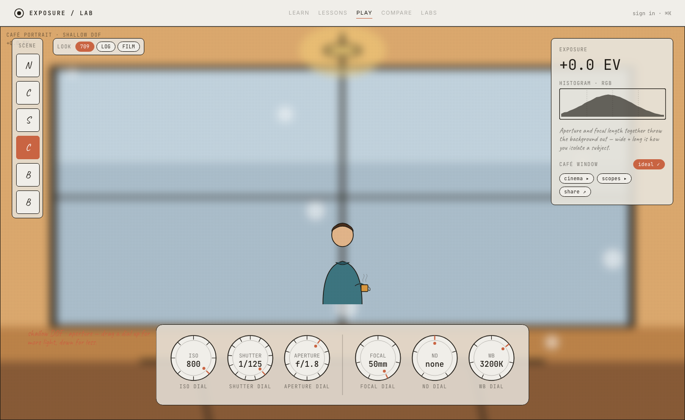
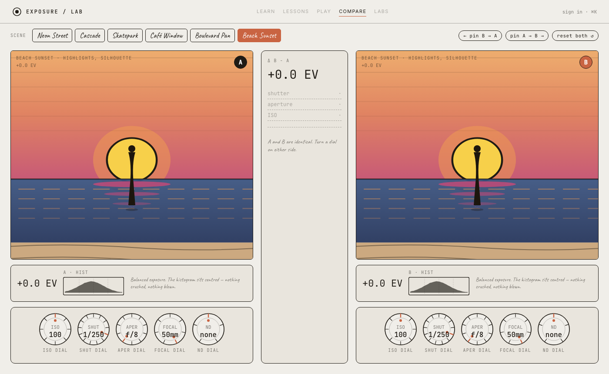
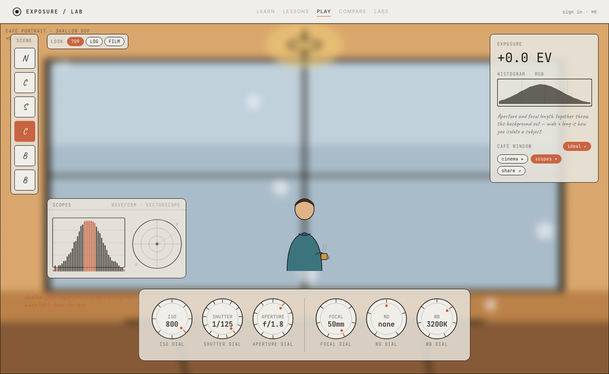
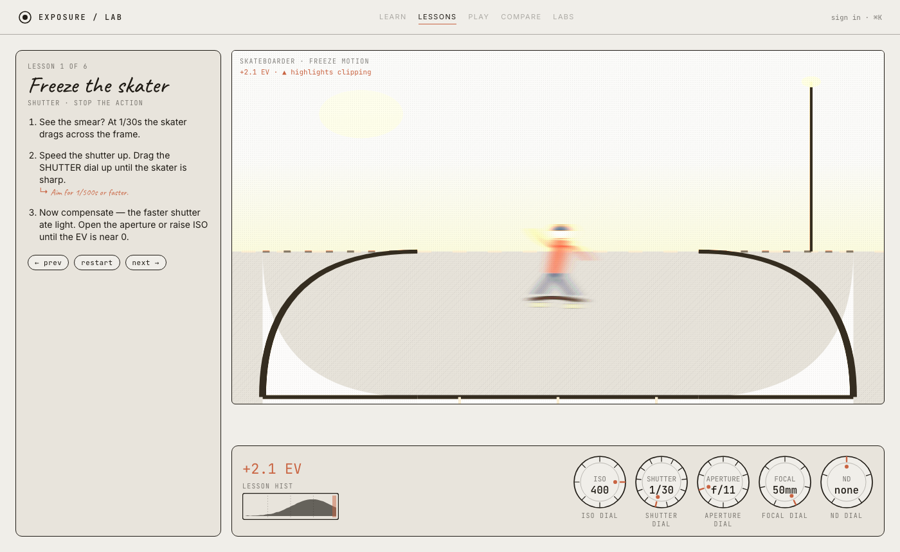

# Exposure Simulator

**Learn exposure by seeing it — turn the dials, watch the scene change.**

An interactive, sketch-styled tool for teaching the photographic exposure triangle. Built with React 18 + TypeScript, zero runtime UI dependencies.

[](https://www.typescriptlang.org/)
[](https://react.dev/)
[](https://vitejs.dev/)
[](#the-verify-suite)

---

## Screenshots

> **Simulator** — pick a scene, spin the dials, watch the physics respond in real time.



> **Compare mode** — A/B two exposures side-by-side with a live delta readout.



> **Scopes** — waveform (luminance) + vectorscope (chroma) the way a real monitor works.



> **Guided Lessons** — six scripted walkthroughs that teach by making you break the image first.



---

## Features

### The Exposure Triangle — for real

The physics engine (`src/exposure.ts`) uses actual log₂ stop math. Every dial change you make is reflected in the scene *and* its downstream consequences:

| Control | What changes on screen |
|---|---|
| ISO | Brightness + sensor grain (shadow-lift noise at high ISO) |
| Shutter | Brightness + scene-aware directional motion blur |
| Aperture | Brightness + depth of field / bokeh (coupled to focal length) |
| Focal length | Field of view + DOF magnification |
| ND filter | Cuts light by 1–10 stops without touching shutter/aperture/ISO |
| White balance (K) | Warm/cool tint relative to the scene's actual light — luminance untouched |

### Six hand-crafted scenes

Each scene ships its own sketch composition, its own correct exposure, and its own white-balance point. Entering a scene starts you at the *ideal* settings so every lesson begins from a known baseline.

| Scene | Motion plane | Lesson |
|---|---|---|
| Neon Street | Subject — horizontal | Low light + ISO noise tax |
| Cascade | Background — vertical | Long exposure silks the waterfall |
| Skatepark | Subject — horizontal | Fast shutter freezes a fast subject |
| Café Window | Subject — horizontal | Aperture and depth of field |
| Boulevard Pan | Background — horizontal | Panning holds subject sharp, streaks the bg |
| Beach Sunset | Subject — horizontal | Highlight discipline |

### Scene-aware directional motion blur

Motion smear is not a global filter — it's routed per scene to the correct plane and axis using inline SVG Gaussian filters:

```typescript
// exposure.ts — motion blur is per-axis, per-plane
const subjectBlur = motionOnSubject
  ? { x: axis === 'horizontal' ? smear : 0, y: axis === 'vertical' ? smear : 0 }
  : { x: 0, y: 0 };
const bgBlur = !motionOnSubject
  ? { x: axis === 'horizontal' ? smear : 0, y: axis === 'vertical' ? smear : 0 }
  : { x: 0, y: 0 };
```

The waterfall genuinely silks *vertically*. The panning shot genuinely streaks *horizontally* behind a sharp subject.

### White balance physics

Each scene declares the actual colour temperature of its light. The WB dial is what the camera *thinks* the light is. Disagreement produces exactly the tint a camera would:

```typescript
// When WB > actual light temp → camera under-corrects → scene warms (orange)
// When WB < actual light temp → camera over-corrects → scene cools (blue)
const wbDelta = wb - scene.lightTemp; // positive = warm drift, negative = cool drift
const tintDeg = clamp(wbDelta / 60, -30, 30); // maps to hue-rotate degrees
```

Luminance (and therefore the histogram) is untouched — matching how in-camera WB actually works.

### Histogram

A live tonal histogram reflects every dial change. Clipping bars appear at both ends when shadows crush or highlights blow. The histogram on the Hero page mirrors the floating dials in real time as a teaser.

### Scopes (Phase 3)

Two pro-grade scopes for the videographer view:

- **Waveform** — luminance per column, exactly what a broadcast monitor shows. A pedagogically honest read: it's derived from what the exposure model says the sensor sees, not a pixel scrape.
- **Vectorscope** — chroma dot driven by WB tint. The skin-tone (orange) axis is drawn for reference. Watch the dot shift as you push WB warm or cool.

Toggle with `scopes ▸/▾` in the Simulator HUD.

### Cinema mode (Phase 3)

Adds an fps selector (24 / 25 / 30 / 48 / 60 / 120) and computes the shutter angle in real time:

```typescript
export function shutterAngle(shutter: number, fps: number): CinemaInfo {
  const angle = 360 * shutter * fps;
  const feel =
    angle < 90  ? 'staccato' :
    angle < 150 ? 'crisp' :
    angle <= 210 ? 'cinematic' :   // 180° sweet spot lives here
    angle < 300 ? 'smeary' : 'over-long';
  return { angle, feel, isSweet: Math.abs(angle - 180) < 15 };
}
```

1/48s at 24fps and 1/120s at 60fps both hit 180°. The HUD highlights the sweet spot and classifies the feel as *staccato / cinematic / smeary / over-long*.

### Tone presets (Phase 3)

`709 / LOG / FILM` — pure post-stage. None of them affect EV, motion, DOF, or grain.

- **709** — the out-of-the-box neutral look
- **LOG** — milky, raw-capture look (low contrast, lifted shadows, desaturated)
- **FILM** — contrasty graded LUT

### Smart fix nudges

Wander ≥ 0.5 stops off ideal and the HUD surfaces a one-click chip — e.g. `try: open aperture 1 stop`. The recommendation never touches the control the current scene's lesson depends on (never shutter on a waterfall, never aperture on a portrait):

```typescript
export function suggestFix(scene: Scene, settings: Settings): FixNudge | null {
  const evOff = derivedEV(settings) - scene.targetEV;
  if (Math.abs(evOff) < 0.5) return null;                // already close enough
  const locked = scene.lessonControl;                     // never touch this dial
  const preferred = evOff > 0 ? 'stop_down' : 'open_up'; // direction needed
  return pickBestDial(settings, locked, preferred);
}
```

### Compare mode (Phase 2)

Two independent exposures of the same scene, side by side, with a centre strip showing the signed delta per control:

```
Δ B − A      +0.0 EV
shutter      −1.0 stop
aperture     +1.0 stop
ISO          ·
```

`pin A → B` and `pin B → A` copy one panel's exposure onto the other — "same exposure, different look" is the reciprocity law made literal.

### Guided Lessons (Phase 2)

Six scripted walkthroughs. Each one pins a scene, starts you at the *wrong* settings, narrates the steps, and detects when you've made the move it's teaching:

1. **Freeze the skater** — 1/30s → 1/500s+, then compensate exposure
2. **Silk a waterfall** — 1/250s → 1/4s+, add ND to keep exposure
3. **Isolate the subject** — f/11 + 35mm → f/2 + 85mm
4. **Low-light reality** — ISO 100 → 800–6400, learn the noise tax
5. **Master the pan** — 1/1000s → 1/30s, watch the streak appear
6. **Protect the highlights** — +4 EV blown sky → −0.5 EV protected drama

### Share via URL (Phase 2)

Every dial change pushes a compact query string into the hash:

```
#/play?scene=cafe&i=4&s=6&a=0&f=4&nd=2&wb=3
```

Indices map to each control's value ladder, so the format is stable across ladder changes. The `share ↗` pill in the HUD copies the absolute URL. Round-trip fidelity is guarded by the verify suite.

---

## The Verify Suite

`scripts/verify-exposure.ts` runs 51 physics + pedagogy assertions against the **real** exposure module via Node's `--experimental-strip-types`. It's documentation-as-code:

```
npm run verify

✓ one-stop ISO math
✓ one-stop shutter math
✓ one-stop aperture math
✓ reciprocity: same EV, different dials
✓ ND stop values (ND2=1, ND8=3, ND64=6, ND1000=10)
✓ freeze shutter: 1/500 stops subject motion
✓ silky shutter: 1/4 silks waterfall
✓ portrait DOF: f/2 + 85mm vs f/11 + 35mm
✓ shadow-lift noise at high ISO
✓ WB tint direction (warm / cool)
✓ share encode/decode round-trip
✓ vectorscope quadrant per WB drift
✓ waveform peak shift with EV
✓ shutter-angle math (180° rule)
✓ tone-preset visual lensing
… 51 total
```

---

## Routes

| Route | Screen | What it is |
|---|---|---|
| `#/` | **Hero** | Manifesto + live dial trio + live histogram |
| `#/play` | **Simulator** | Full-bleed scene, 6-dial control deck, HUD |
| `#/play?…` | **Simulator** | Hydrated from a shared exposure link |
| `#/compare` | **Compare** | A/B side-by-side with live Δ readout |
| `#/lesson/1..6` | **Lessons** | Six scripted walkthroughs |

---

## Quick Start

```bash
npm install
npm run dev       # http://localhost:5173
npm run build     # strict typecheck + production bundle
npm run preview   # serve the production build
npm run verify    # 51 physics + pedagogy checks
```

---

## Architecture

```
src/
  exposure.ts        physics core: stops math, scenes, motion routing,
                     WB, histogram, scopes, shutter-angle, tone presets
  useExposure.ts     shared settings + derived-values hook
  share.ts           URL ↔ settings encode/decode
  theme.ts           design tokens (ported from wireframe-primitives)
  styles.css         .wf-* sketch design system
  components/
    AppChrome        nav shell + route switching
    Dial             vertical-drag / wheel / keyboard dial
    Histogram        live tonal distribution
    Scopes           waveform + vectorscope
    ScenePlaceholder sketch scene art + SVG blur filters
    Callout          one-line HUD teaching text
  screens/
    Hero             landing page
    Simulator        main interactive tool
    Compare          A/B comparison mode
    Lesson           guided lesson runner
scripts/
  verify-exposure.ts 51 checks against the real module
```

**Stack:** React 18 · TypeScript (strict) · Vite 5 · zero runtime UI dependencies

The deliberately lo-fi **wireframe sketch aesthetic** (warm paper, hand-drawn strokes, single amber accent) is preserved throughout — design tokens are ported verbatim from the original `wireframe-primitives.jsx` handoff bundle.

---

## Adding Screenshots

Drop actual screenshots into `docs/screenshots/` to fill in the image placeholders above:

```
docs/screenshots/
  simulator.png
  compare.png
  scopes.png
  lesson.png
```

`npm run dev`, open `http://localhost:5173`, and grab each screen.
